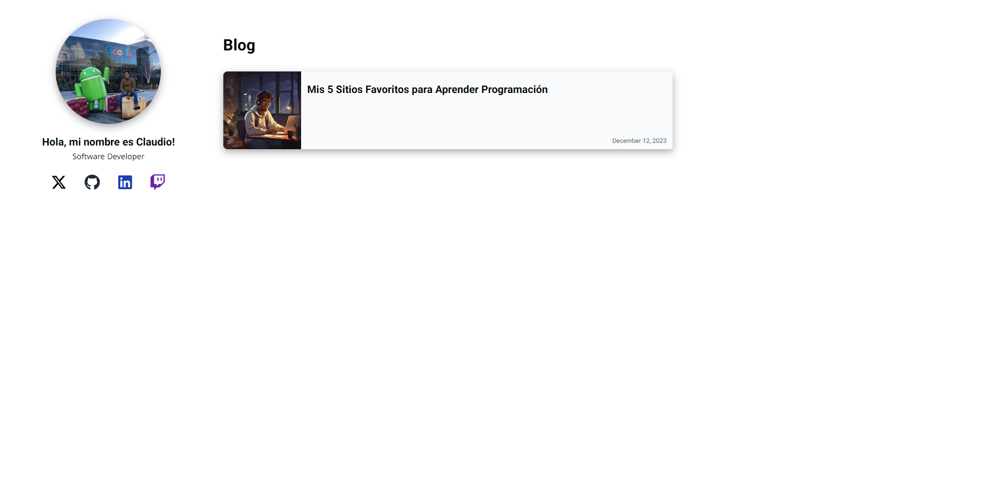

<div align="center">
  <h1>🖥️ - Claudio Coder Blog - 📱</h1>
</div>



[](https://github.com/claudiocoder/claudio_coder_page/actions/workflows/ui.yml) 


## Description
Claudio Coder Personal Blog is a personal blog platform where I share my thoughts, experiences, and knowledge about coding, technology, and software development. This project aims to provide insightful content for developers of all levels, offering tutorials, code snippets, and articles on various tech topics.

## Main Features
- **Responsive Design**: Accessible on all devices, ensuring a great reading experience on desktops, tablets, and mobile phones.
- **Syntax Highlighting**: Enhanced code readability with syntax highlighting for various programming languages.
- **SEO Optimized**: Improved search engine visibility for better reach.

## Technologies Used
- **Frontend**: Next.js
- **Backend**: Node.js
- **Styling**: Tailwind
- **Deployment**: Vercel


## Installation
1. Clone the repository:
    ```sh
    git clone https://github.com/claudiocoder/claudio_coder_page.git
    cd claudio-coder-page
    ```
2. Install dependencies:
    ```sh
    npm install
    ```
3. Start the application:
    ```sh
    npm run dev
    ```
5. Visit `http://localhost:3000` in your browser to see the blog in action.

## Usage
Once installed, you can use the following commands:
- **Start Development Server**:
    ```sh
    npm run dev
    ```
- **Build for Production**:
    ```sh
    npm run build
    ```
- **Run Tests**:
    ```sh
    npm test
    ```

## Contribution
Contributions are welcome! Please follow these steps:
1. Fork the project.
2. Create a new branch (`git checkout -b feature/YourFeature`).
3. Make your changes.
4. Commit your changes (`git commit -m 'Add some feature'`).
5. Push to the branch (`git push origin feature/YourFeature`).
6. Open a Pull Request.